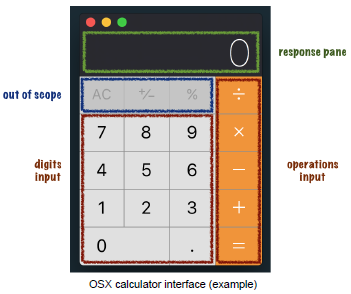

<h1>JavaScript Calculator Challenge</h1>
<h3>Author: Tim Lucas</h3>
<h6>Coding Exercise: Browser-based Javascript Calculator</h6>

<h6>Description</h6>

Implement a very rudimentary calculator, with a classic interface similar to those found in many settings, including the one in several Apple products, like iOS and OSX (see image below).

Input to the calculator will come via mouse clicks to your HTML elements.

All input will be echoed to the response pane, with results rendered on press of any (orange) operation button. Order of operations and chained operations (see Testing, below) should be supported.

Your calculator should show an error on any division by zero or overflow beyond 10 digits.

This test will specifically be looking to test the (orange) basic arithmetic operation buttons for addition, subtraction, multiplication and division of rational numbers (not just integers!). The other buttons (` AC `, ` ± ` and ` % `) are not required in this exercise.

<h6>Constraints</h6>

Your solution is expected to consist of plain-text source files, limited to content in:

<ul>
<li>Javascript</li>
<li>HTML</li>
<li>CSS</li>
</ul>

<h6>The "No JQuery" Rule</h6>

You are not permitted to import any third party libraries or frameworks, and are asked here to implement this entirely in the native structures offered in the above standards.

